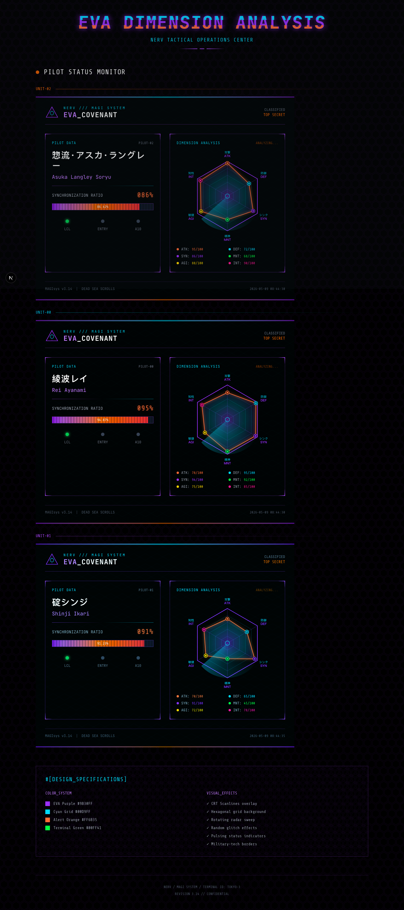

# EVA Covenant

<div align="center">

**新世纪福音战士主题人格测试**

基于加权曼哈顿距离与等级归一化算法的性格匹配系统，通过 30+ 道精选问题揭示你的 EVA 驾驶员人格。

[](https://github.com/xiaoyu6420/EVA-covenant/actions/workflows/deploy.yml)
[](https://hub.docker.com/r/xiaoyuyu123/eva-covenant)
[](LICENSE)

</div>



## Key Features

1. 🧠 **科学匹配算法** — 加权曼哈顿距离 + 等级归一化，15 维度精准人格画像
2. 🎯 **动态触发系统** — 门控问题 + 三重条件检测（补完 / 初号机觉醒 / 亚当）
3. 🌐 **多语言支持** — 中文 / English / 日本語，基于数据库的 i18n 方案
4. 📱 **移动端优先** — NERV 橙 + EVA 紫设计系统，Framer Motion 动效
5. 📊 **管理后台** — 题目 CRUD、Excel 导入导出、数据分析面板
6. 🔗 **社交分享** — 结果卡片生成、分享链接转化追踪
7. 🐳 **容器化部署** — Docker Hub 镜像、自动备份、健康检查

| 🎮 测试流程 | 📊 维度分析 | 🏷️ 人格卡片 |
| --- | --- | --- |
| 30+ 精选问题，门控触发机制 | 15 维度加权评分，等级归一化 | 个性化人格匹配 + 社交分享 |

## Quick Start

### Docker Compose 部署（推荐）

适合生产环境，包含自动备份、健康检查、日志管理。

```bash
# 克隆项目
git clone https://github.com/xiaoyuyu6420/EVA-covenant.git
cd EVA-covenant

# 配置环境变量
cp .env.production.example .env
# 编辑 .env，设置管理员密码等

# 一键部署
docker compose up -d
```

服务将在 `http://localhost:8092` 启动。

### Docker 直接运行

```bash
docker pull xiaoyuyu123/eva-covenant:latest
docker run -d \
  --name eva-covenant \
  -p 8092:3002 \
  -v eva-covenant-db:/app/prisma \
  --restart unless-stopped \
  xiaoyuyu123/eva-covenant:latest
```

### 本地开发

```bash
# 安装依赖
npm ci

# 生成 Prisma Client
npx prisma generate

# 初始化数据库
npx tsx prisma/seed.ts

# 启动开发服务器
npm run dev
```

访问 `http://localhost:3002`。

## Architecture

```
┌─────────────────────────────────────────────────────────┐
│                    User Flow                            │
│                                                         │
│  Welcome → Questions (30) → Gate (pos 19) → Trigger    │
│      ↓                                        ↓        │
│  Calculating ← scoresToGrades ← dimScores ← answers    │
│      ↓                                                  │
│  Result (matchPersonality → share)                      │
└─────────────────────────────────────────────────────────┘

┌─────────────────────────────────────────────────────────┐
│                 CI/CD Pipeline                          │
│                                                         │
│  Local (master) ──push──▶ GitHub                       │
│                              ↓                          │
│                        GitHub Actions                   │
│                         ┌────┴────┐                     │
│                         │  test   │ npm ci, test, tsc   │
│                         └────┬────┘                     │
│                         ┌────▼────┐                     │
│                         │  build  │ Docker → Docker Hub │
│                         └────┬────┘                     │
│                              ↓                          │
│                    xiaoyuyu123/eva-covenant              │
│                              ↓                          │
│                    Server (docker pull)                  │
└─────────────────────────────────────────────────────────┘
```

## Matching Algorithm

### 评分流程

```
原始分数 (0-6/维度) → 等级归一化 (4L + 4M + 4H + 3X) → 加权曼哈顿距离 → 相似度百分比
```

### 核心参数

| 参数 | 值 | 说明 |
|------|-----|------|
| `delta` | 3% | Top1/Top2 差距阈值 |
| `threshold` | 50% | 最低相似度（低于则回退到 ADAM） |
| `questionsPerDim` | 2 | 每维度题目数 |
| `maxScorePerQ` | 3 | 每题最高分 |

### 特殊触发条件

| 类型 | 条件 |
|------|------|
| **CMPL（补完）** | gate="complement" + C1≥5 + A3≤4 |
| **U13G（初号机觉醒）** | gate="transcend" + A1≥5 + D3≥5 |
| **ADAM（亚当）** | 相似度 < 50% 且 Top1/Top2 差距 < 3% |

### 向量格式

```
HML-MML-HHL-MHM-HLL
│   │   │   │   │
A   B   C   D   E
│   │   │   │   │
1-3 1-3 1-3 1-3 1-3   ← 每模型 3 维度 (L/M/H/X)
```

## Production Deployment

### 环境变量

| 变量 | 默认值 | 说明 |
|------|--------|------|
| `PORT` | 8092 | 外部访问端口 |
| `ADMIN_PASSWORD` | admin123 | 管理后台密码 |
| `ADMIN_SECRET` | - | Session 加密密钥 |
| `IMAGE` | xiaoyuyu123/eva-covenant:latest | Docker 镜像地址 |

### 数据安全

- **持久化存储** — SQLite 数据库使用 Docker Named Volume，容器重建不丢数据
- **自动备份** — 备份 sidecar 每日使用 `sqlite3 .backup` 热备份，保留 30 天
- **日志轮转** — 单文件 10MB 上限，最多 3 个轮转文件
- **健康检查** — 每 30 秒检测 `/api/stats`，异常自动重启

### 服务器部署脚本

```bash
# 使用部署脚本（首次部署）
bash scripts/deploy.sh
```

## Tech Stack

| Layer | Tech |
|-------|------|
| Framework | Next.js 16 (App Router) + React 19 |
| Language | TypeScript |
| Database | SQLite + Prisma ORM |
| UI | Tailwind CSS + shadcn/ui + Framer Motion |
| Testing | Vitest |
| CI/CD | GitHub Actions → Docker Hub |
| Container | Docker + Docker Compose |

## Project Structure

```
src/
├── app/
│   ├── page.tsx              # 主页面
│   ├── admin/page.tsx        # 管理后台
│   └── api/                  # API 路由
│       ├── quiz/route.ts     # 题目获取
│       └── match/route.ts    # 服务端匹配
├── hooks/
│   └── useQuiz.ts            # 测试状态机
├── lib/
│   ├── match-engine.ts       # 匹配算法
│   ├── types.ts              # 类型与常量
│   ├── storage.ts            # localStorage 持久化
│   └── i18n/                 # 国际化
├── components/
│   ├── WelcomeScreen.tsx
│   ├── TestScreen.tsx
│   └── ResultScreen.tsx
prisma/
├── schema.prisma             # 数据模型
└── seed.ts                   # 种子数据
```

## Development

```bash
# 运行测试
npm run test

# 类型检查
npx tsc --noEmit

# 代码检查
npm run lint

# 数据库操作
npx prisma db push             # 应用 schema 变更
npx tsx prisma/seed.ts         # 重新导入种子数据
```

## License

MIT
